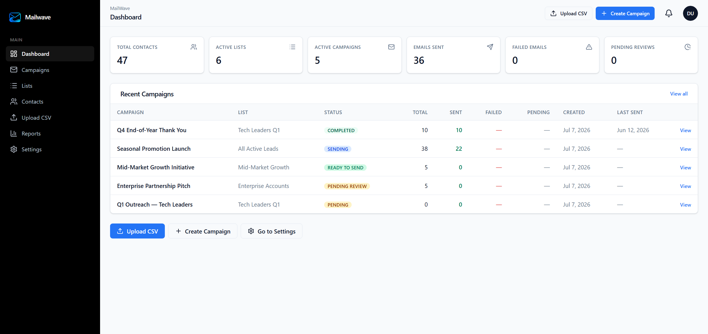
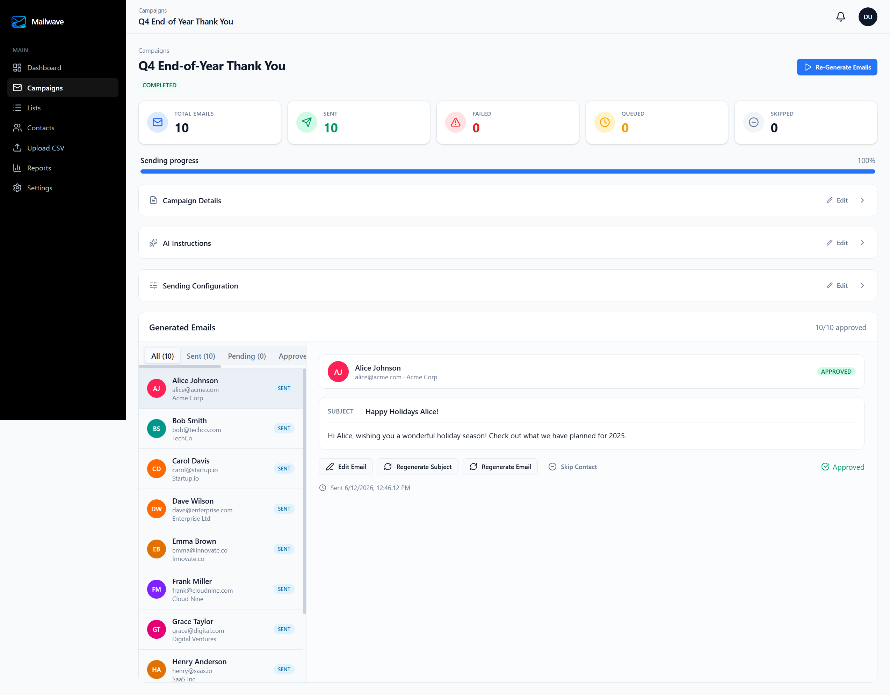

# Mailwave

Mailwave is an AI-assisted cold email platform for managing contacts, building campaigns, generating personalized emails, reviewing output, and sending at scale from a single dashboard.

## Overview

The product combines:

- contact and list management
- CSV imports
- campaign creation and approval flows
- AI-generated email content
- SMTP delivery
- background workers for campaign processing
- dashboard and reporting views

## Screenshots

### Dashboard



### Campaign View



## Core Features

- Dashboard with campaign health, activity totals, and quick actions
- Campaign workflow with statuses like pending review, ready to send, sending, paused, and completed
- Generated email review panel with approve, edit, regenerate, and skip actions
- Contact and list organization for targeted outreach
- CSV upload flow for bulk lead import
- SMTP configuration for outbound sending
- AI provider integration through API keys
- Queue-based background processing with BullMQ workers

## Tech Stack

- Next.js 16
- React 19
- TypeScript
- Tailwind CSS 4
- shadcn/ui + Radix UI
- Prisma
- PostgreSQL
- Redis
- BullMQ
- NextAuth
- OpenAI-compatible and Anthropic AI integrations

## Project Structure

```text
app/                 Next.js app router pages and API routes
components/          UI, layout, and feature components
lib/                 shared business logic and integrations
jobs/                background worker entrypoints
prisma/              schema and seed data
docs/                product and operational documentation
```

## Getting Started

### Prerequisites

- Node.js
- PostgreSQL
- Redis

### Environment

Create `.env` from the example and configure at least:

```bash
DATABASE_URL=postgresql://...
REDIS_URL=redis://localhost:6379
AUTH_SECRET=...
ENCRYPTION_KEY=...
NEXTAUTH_URL=http://localhost:3001
```

### Install

```bash
npm install
```

### Database setup

```bash
npm run prisma:push
npm run seed
```

The seed is idempotent and creates:

- `demo@mailwave.app`
- `password123`

### Run the app

```bash
npm run dev
```

Open [http://localhost:3001](http://localhost:3001).

### Run the worker

In a second terminal:

```bash
npm run worker
```

## Testing

```bash
npm run typecheck
npm run lint
npm run test
npm run test:e2e
```

Notes:

- unit and component tests run with Vitest
- end-to-end tests run with Playwright
- campaign processing paths depend on Redis and the worker process

## Docker

For the full stack with app, worker, PostgreSQL, and Redis:

```bash
copy .env.docker.example .env
docker compose up -d --build
```

See [docs/docker.md](docs/docker.md) for the full Docker guide.

## Design System

The interface is built on `shadcn/ui` primitives with Tailwind token-based styling defined in `app/globals.css`. Reusable Mailwave UI patterns live under:

- `components/ui/*`
- `components/shared/*`
- `components/layout/*`

## Status

This repository is an active product codebase and includes both the web app and background processing for AI campaign generation and sending.
